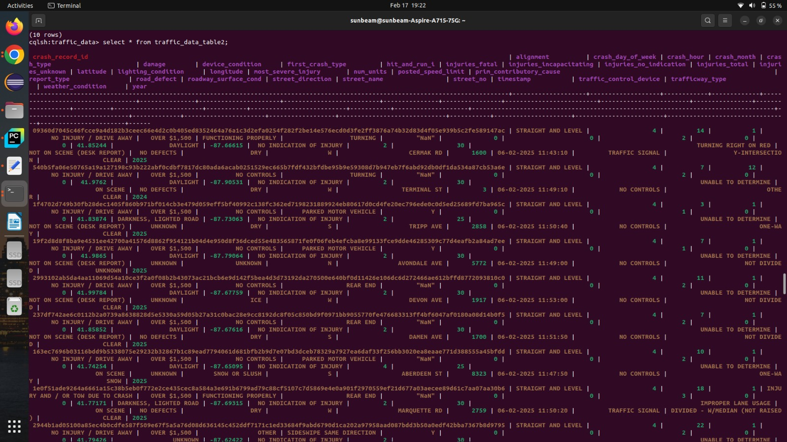
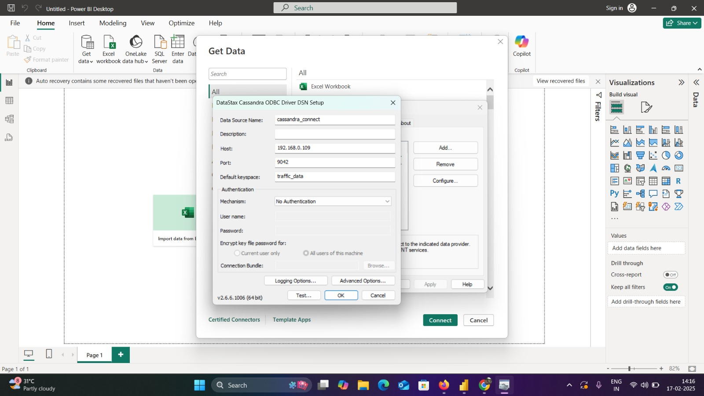
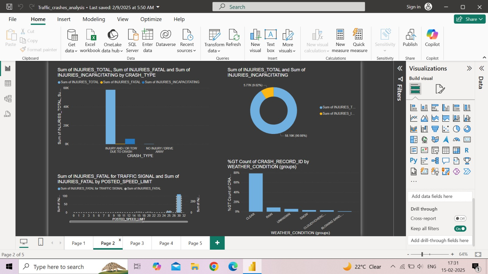

# 🚦 Traffic Crashes Streaming & Analysis

## 📌 Project Overview  
This project processes real-time **traffic crashes data** using **Kafka, Spark, and Cassandra** and visualizes it in **Power BI**.

## 🔗 Dataset  
- **Source**: [Traffic Crashes Data](https://catalog.data.gov/dataset/traffic-crashes-crashes)  
- **Sample File**: [Download Here](data/US_traffic_sample.csv)

## ⚙️ Project Workflow  
1️⃣ Kafka Producer reads traffic crash data from a local server and streams it.
2️⃣ Spark Consumer processes transformations on the streamed data.
3️⃣ Processed data is stored in Cassandra for efficient querying.
4️⃣ Power BI connects to Cassandra (via ODBC) for visualization and analysis.

---

## 🛠️ Technology Stack  
- **Streaming**: Kafka  
- **Processing**: Spark  
- **Storage**: Cassandra  
- **Visualization**: Power BI  
- **Connection**: ODBC Driver  

---

## 🚀 Setup Instructions  

### 1️⃣ Kafka Producer & Consumer  
- **Producer Code**: [producer.py](kafka/producer%20(1).py)  
- **Consumer Code**: [consumer_spark.py](kafka/consumer_spark.py)  

### 2️⃣ Cassandra Table Schema  
- **Schema File**: [schema.txt](Cassandra/schema.txt)  
- **Stored Data Preview**:  
  

### 3️⃣ Power BI Connection  
- **ODBC Driver Download**: [ODBC Driver Link](PowerBI/odbc_driver_link.txt)  
- **Cassandra to Power BI Connection**:  
    
- **Power BI Dashboard Preview**:  
  

---

## 📈 Results & Insights  
- Power BI provides **real-time analysis** of crash patterns.  
- Data can be **filtered & visualized** based on different crash parameters.

---

